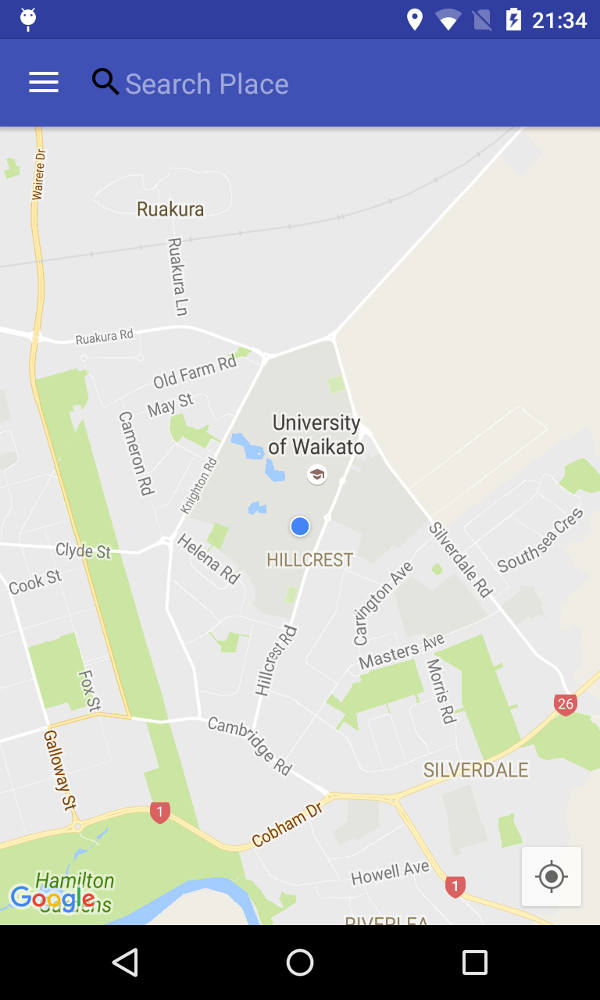

# Mobile Application to Promote Energy Conservation

The direction and navigation android application for COMP592 of the University fo Waikato. This app is designed to promote energy conservation by **encouraging the users to consider public transport** when they search directions.

## Evaluation

Through the evaluation, the functions of our application were tested and this user interface design **was verified as achieving the intended goal**.

## Screenshots

## Developed By
* Caleb Yuan Tian
